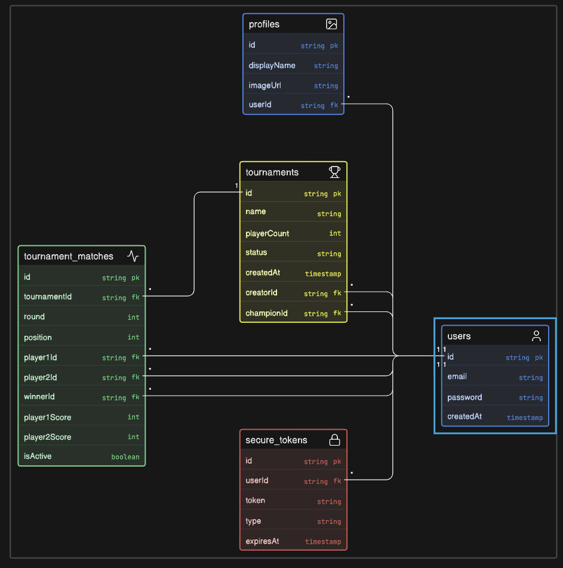

# Ping Pong Tournaments API

A RESTful backend for single-elimination ping pong tournaments (2, 4, or 8 players). Built with Spring Boot, JWT authentication, and PostgreSQL.

---

## What It Does

Organizers create a tournament by choosing a bracket size and entering player usernames. The system builds the full bracket immediately, activates the first match, and advances winners automatically until a champion is crowned. User registration, login, profile management, and profile images (Cloudinary) work the same as the original auth stack.

---

## Tech Stack

- **Java 17** / **Spring Boot 4**
- **Spring Security** with stateless JWT authentication
- **Spring Data JPA** / **PostgreSQL**
- **Cloudinary** for profile image uploads
- **Spring Mail** + **Thymeleaf** for transactional emails
- **Lombok**

---



## User Stories

### Authentication & Account Management
- Register, verify email, log in with JWT, change password, upload profile image, soft-delete account.

### Tournaments
- As a creator, create a tournament with name, size (2/4/8), and player usernames.
- As anyone, list tournaments and view full bracket detail.
- As the creator, adjust scores on the active match; the system detects wins and advances the bracket.
- As the creator, delete a tournament you created.

---

## API Endpoints

Public routes do not require a JWT. Protected routes need `Authorization: Bearer <token>`.

### Auth & Users — `/auth/users`

| Method | Endpoint | Auth | Description |
|--------|----------|------|-------------|
| `POST` | `/auth/users/register` | Public | Register a new user |
| `POST` | `/auth/users/login` | Public | Log in and receive a JWT |
| `GET` | `/auth/users/register/verify?token=` | Public | Verify email |
| `GET` | `/auth/users/forgot-password` | Public | Request password reset email |
| `POST` | `/auth/users/reset-password?token=` | Public | Reset password |
| `PUT` | `/auth/users/change-password` | Required | Change password |
| `GET` | `/auth/users/profile` | Required | Get current profile |
| `POST` | `/auth/users/profile-image` | Required | Upload profile image |
| `DELETE` | `/auth/users/delete` | Required | Soft-delete own account |

### Tournaments — `/tournaments`

| Method | Endpoint | Auth | Description |
|--------|----------|------|-------------|
| `GET` | `/tournaments` | Public | List all tournaments |
| `GET` | `/tournaments/{id}` | Public | Tournament detail with bracket |
| `POST` | `/tournaments` | Required | Create tournament |
| `DELETE` | `/tournaments/{id}` | Required | Delete tournament (creator only) |

### Matches — `/matches`

| Method | Endpoint | Auth | Description |
|--------|----------|------|-------------|
| `PATCH` | `/matches/{matchId}/score` | Required | Adjust score on active match (creator only) |

---

## Local Development

```bash
docker compose up -d
./mvnw spring-boot:run -Dspring-boot.run.profiles=qa
```
